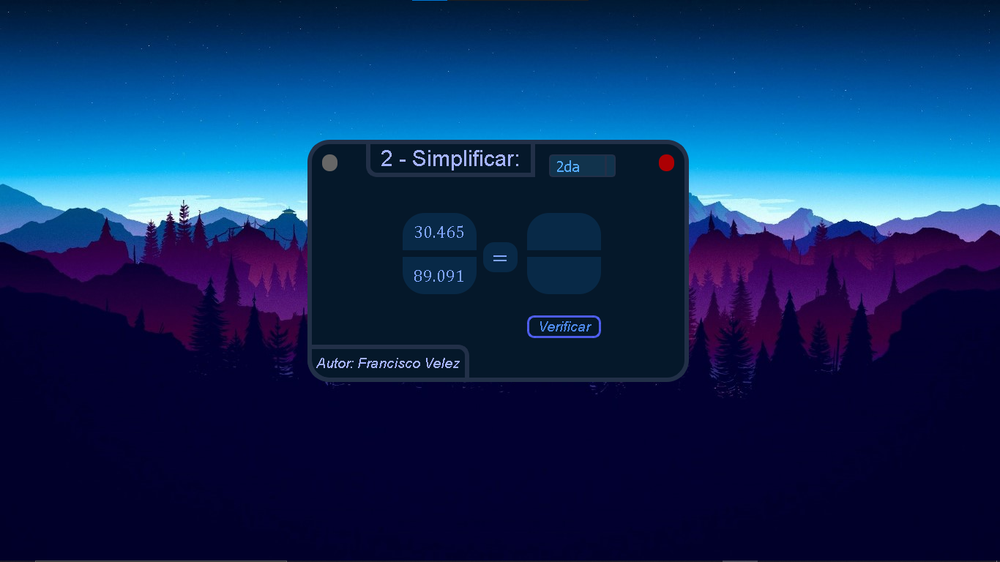
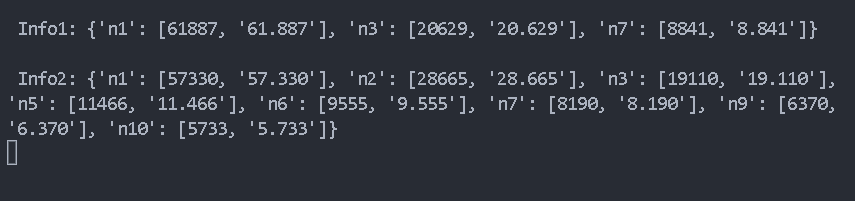

# Frac-Simplificar

Project #2 with Python - PyQt5. Exercise: Fractions to simplify.

Functions:
* Test your divisibility criteria.
* You can view the console to see the correct results.
* You can check your answers.

* click and drag to move the window.
* red button to exit.
* gray button to minimize.

* you can check up to get eleventh.
* A bar which tells you how many simplifications
  has the current number.

* Verify button.
* Author name.

* A subWindow that will give you information about
  your answer.

Execute:
* To start, run the file __main__.py

* Then an interface appears with two numbers,
  one on top of the other, representing a fraction.

* In the console the program prints by console in a dictionary
  from python the information of the two numbers,
  if you have first, second, third, etc.

**Image 1**

**Image 2**

**Best regard !!!**

<cite>Author: Francisco Velez</cite>
